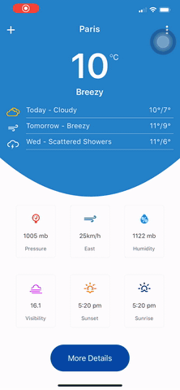

<p align="center">
  <a href="https://github.com/cleandersonlobo/react-native-weather/">
    
  </a>

  <h1 align="center">react-native-weather</h1>

  <p align="center">
    The Weather App UI Design made with React-native.  <br /><a href="https://www.uplabs.com/posts/weather-app-6618236e-d929-4eb3-94de-d353a014a3f5">Design found here</a>
    
  </p>
  <p align="center">
  <a href="https://github.com/cleandersonlobo/react-native-weather/issues/new">Request feature</a> |
  <a href="https://github.com/cleandersonlobo/react-native-weather/issues/new">Report bug</a>
  <p>
</p>


### Design


##  implementation (Dashboard)


##  implementation (Forecast Details)


## Running



### Weather Data

- [Yahoo Weather API](https://developer.yahoo.com/weather/)


### Dependencies

 - react-navigation
 - react-native-chart-kit 
 - react-native-svg
 
 ## Get Started
 
 #### 1. Clone the Repo
 
 On the command prompt run the following commands
 ```sh
 $ git clone https://github.com/cleandersonlobo/react-native-weatcher.git
 
$ cd react-native-weather
 
$ npm install or yarn 

# ios
$ cd ios/ && pod install 

$ react-native run ios or android
 
 ```

## Author

*	[Cleanderson Lobo](mailto:cleandersonlobo@gmail.com)


## Flutter

The same challenge but made with Flutter.

- [flutter_weather_app](https://github.com/cleandersonlobo/flutter_weather_app)